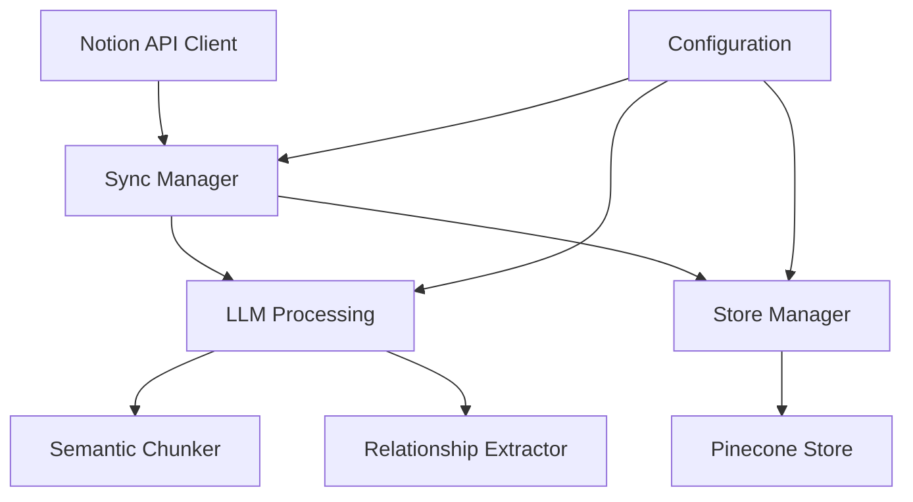
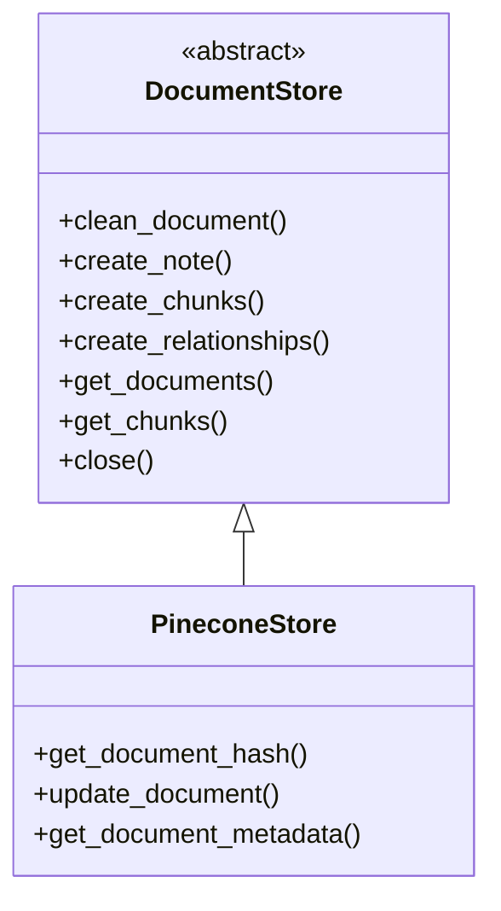
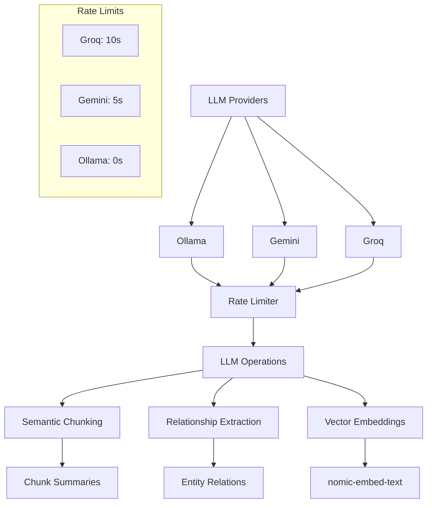

# System Patterns

## Architecture Overview

## Core Components

### 1. Sync Manager (`NotionSync`)
- Central orchestrator for the sync process
- Manages document processing pipeline
- Handles content updates and hash checking
- Coordinates store updates
- Tracks sync statistics

### 2. Document Store

### 3. LLM Integration

## Design Patterns

### 1. Strategy Pattern
- Document store implementation
- LLM provider selection
- Rate limiter configuration

### 2. Factory Pattern
- Store creation via StoreManager
- LLM provider initialization
- Configuration loading

### 3. Observer Pattern
- Sync statistics tracking
- Progress monitoring
- Error logging

### 4. Template Method Pattern
- Base document store operations
- Chunking pipeline
- Relationship extraction

## Data Flow

## Key Technical Decisions

### 1. Storage Implementation
- Pinecone for vector storage and metadata
- Vector search capabilities
- Document metadata management
- Hash-based change detection
- Clean interface through DocumentStore base class

### 2. LLM Integration
- Multiple provider support:
  - Ollama
  - Gemini
  - Groq
- Provider-specific rate limiting:
  - Groq: 10 second delay
  - Gemini: 5 second delay
  - Ollama: No delay
- Semantic chunking:
  - Target size: 400-500 tokens
  - Valid range: 35-1200 tokens
  - Small chunk merging (<100 tokens)
  - Chunk summaries
- Relationship extraction with validation
- Vector embeddings generation

### 3. Configuration Management
- YAML-based configuration
- Environment variable interpolation
- Store configuration
- Rate limit configuration
- Model selection

### 4. Error Handling
- Graceful degradation
- Fallback chunking
- Validation checks
- Statistics tracking
- Clean error recovery

## System Boundaries

### Internal Components
- Notion API client
- LLM processors
- Document store
- Configuration management

### External Dependencies
- Notion API
- LLM providers
- Vector embeddings
- Pinecone service

## Performance Considerations

### Optimization Points
1. Incremental updates via hash checking
2. Smart chunking with fallbacks
3. Rate limit management
4. Connection handling
5. Resource cleanup

### Scalability Factors
1. Document size/count
2. Pinecone API performance
3. Network latency
4. Memory usage

### Critical Paths
1. Document Processing
   - Chunk generation
   - Summary creation
   - Relationship extraction
   - Vector embeddings

2. Storage Operations
   - Data cleanup
   - Content updates
   - Metadata management

3. Error Recovery
   - Validation checks
   - Fallback strategies
   - Resource cleanup
   - State management
